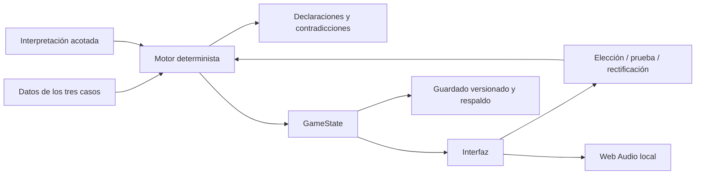

# Arquitectura

## Elección técnica

TypeScript estricto + Vite + HTML/CSS. No hay biblioteca de UI en producción. Las pantallas son pequeñas, están separadas por función y se renderizan a partir de un único estado. El DOM nativo mantiene formularios, controles de teclado y diálogos accesibles. Vite produce un paquete estático con rutas relativas y nombres de recursos versionados.

Esta elección reduce tamaño y dependencias de ejecución. El motor no importa DOM, audio, almacenamiento ni herramientas de build. Se prueba directamente en Node mediante Vitest.

## Organización

| Directorio / archivo | Responsabilidad |
| --- | --- |
| `src/engine/types.ts` | Esquema estricto de escenas, condiciones, efectos, pruebas y guardados |
| `src/engine/engine.ts` | Inicio, transiciones, respuestas, presentaciones y resolución de confrontaciones |
| `src/engine/conditions.ts` | Evaluador declarativo sin código específico de casos |
| `src/engine/memory.ts` | Conflictos entre afirmaciones, fuentes conocidas y reglas temporales/relacionales |
| `src/engine/interpreter.ts` | Normalización, frases acotadas, negación y ambigüedad |
| `src/engine/persistence.ts` | Validación, migración v1, respaldo, progreso y guardado |
| `src/engine/validation.ts` | Integridad de referencias, salidas y alcance estático |
| `src/cases/` | Tres historias completas; contenido separado de lógica |
| `src/ui/home.ts` | Menú y selección de casos |
| `src/ui/game.ts` | Sala, confrontación y desenlace |
| `src/ui/panels.ts` | Expediente, pruebas, archivo, preferencias y vista previa |
| `src/ui/art.ts` | Escenografía y portadas SVG originales |
| `src/audio/ambience.ts` | Audio generado en el dispositivo |
| `src/main.ts` | Coordinación de acciones, estado, persistencia y modales |
| `tests/` | Pruebas del motor y navegador |

## Seis capas de información

1. `CaseData.truth`: verdad autoral fija. No se muta ni se muestra como respuesta correcta durante la partida.
2. `GameState.playerKnowledge`: recuerdos/conocimientos del protagonista, aparte de lo que declara.
3. `declarations`: historial ordenado de afirmaciones, incertidumbres y silencios.
4. `investigatorEvidence`: fuentes disponibles para el investigador del caso.
5. `discoveredEvidence` y `presentedEvidence`: lo encontrado por el jugador y lo compartido explícitamente.
6. `suspicion`, `tension`, `flags`: valoración narrativa, emoción y decisiones contextuales.

Cada caso tiene un investigador principal. Las fichas de otros personajes contienen su conocimiento y secretos autorales. No se implementa una red de agentes ni un sistema de IA.

## Persistencia

Se eligió localStorage porque el estado es texto compacto y las escrituras ocurren en puntos discretos de decisión. No se guardan ilustraciones, audio ni datos externos. El guardado contiene versión, fecha, partida, preferencias y progreso acumulado. La última versión completa se conserva como respaldo antes de la siguiente escritura.

La carga valida tipos y referencias; admite v1 del prototipo; preserva una versión futura desconocida sin sobrescribirla. Si el JSON principal está roto, intenta recuperar el respaldo. Los errores de cuota o acceso producen un aviso; la partida en memoria sigue utilizable. Las exportaciones son locales y no transmiten información.

## Seguridad, rendimiento y despliegue

Todo texto insertado en HTML pasa por escape, incluidas las declaraciones originales. La UI no usa `eval`, no interpreta HTML del jugador y no hace solicitudes externas. Solo Web Audio usa azar para sintetizar ruido; la narrativa no usa números aleatorios.

Los paquetes de TypeScript, Vite, Vitest y Playwright son herramientas de desarrollo. La producción contiene HTML, CSS, JavaScript, favicon y service worker. Las fuentes son locales. No hay configuración de secretos ni servidor de aplicación.

El service worker precarga exclusivamente los archivos emitidos por esta compilación y su índice. Su nombre de caché deriva de los hashes del bundle; las versiones anteriores de esta aplicación se retiran cuando se activa la nueva. No se fuerza activación durante una sesión abierta.
